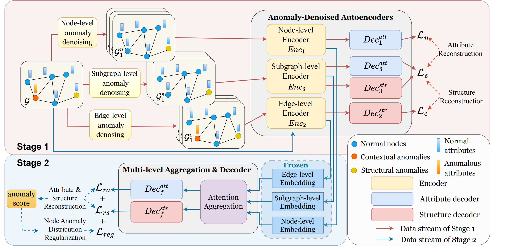

## [ADA-GAD: Anomaly-Denoised Autoencoders for Graph Anomaly Detection](https://arxiv.org/abs/2312.14535)
[comment]: <> ([Paper]&#40;https://arxiv.org/abs/2312.14535&#41)
<a href="https://arxiv.org/abs/2312.14535"></a>

This repository contains a PyTorch implementation for our paper "ADA-GAD: Anomaly-Denoised Autoencoders for Graph Anomaly Detection".

## Framework Details



We introduce a novel twostage framework called Anomaly-Denoised Autoencoders for Graph Anomaly Detection (ADA-GAD). In the first stage, we design a learning-free anomaly-denoised augmentation method to generate graphs with reduced anomaly levels. We pretrain graph autoencoders on these augmented graphs at multiple levels, which enables the graph autoencoders to capture normal patterns. In the next stage, the decoders are retrained for detection on the original graph, benefiting from the multi-level representations learned in the previous stage.

## Getting Started

### Environment Setup

```shell
git clone https://github.com/jweihe/ADA-GAD.git
cd ADA-GAD
conda create -n ada-gad python=3.8
conda activate ada-gad
pip install -r requirements.txt
```

### Main Usage

Use the following command to run the main script with configuration options:

```bash
python main.py --use_cfg --seeds 0 --dataset $dataset
```
We support using datasets from [data](https://github.com/pygod-team/data). You can download these datasets and place them in the data directory `data`. 
Alternatively, you can run the code directly, and the dataset will be downloaded automatically.

## Citation

```
@inproceedings{he2024ada,
  title={Ada-gad: Anomaly-denoised autoencoders for graph anomaly detection},
  author={He, Junwei and Xu, Qianqian and Jiang, Yangbangyan and Wang, Zitai and Huang, Qingming},
  booktitle={Proceedings of the AAAI Conference on Artificial Intelligence},
  volume={38},
  number={8},
  pages={8481--8489},
  year={2024}
}
```

## Acknowledgements

This code is built on [pygod](https://github.com/pygod-team/pygod) and [GraphMAE](https://github.com/THUDM/GraphMAE). We thank the authors for sharing the codes.
